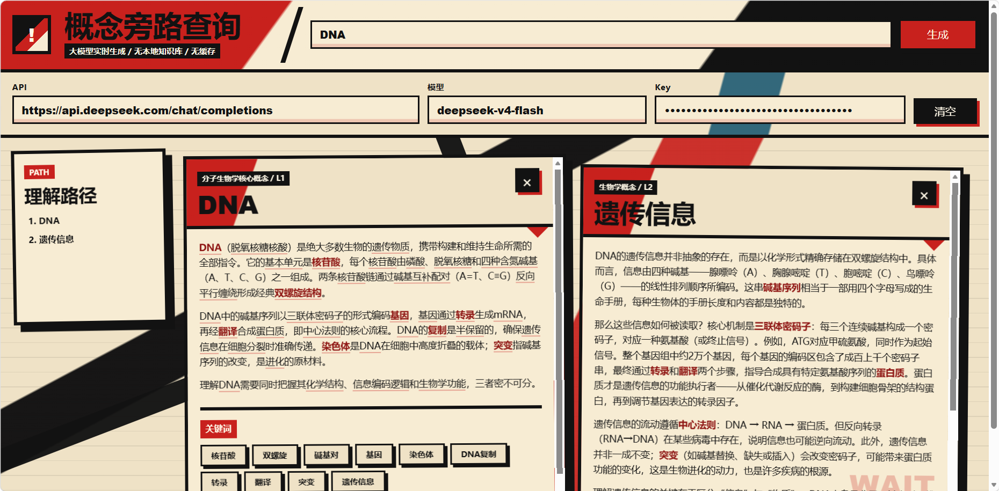

# 知识关联搜索

一个用来学习概念的网页工具。

输入一个主题，它会生成一张解释卡片，并把回答里的相关术语、关键词继续变成可点击入口。你可以沿着这些入口一层层展开，形成自己的理解路径。



## 能干什么

- 学习一个陌生概念，并继续追踪它背后的相关知识。
- 准备计算机八股面试，例如进程、线程、锁、网络、数据库、操作系统、JVM 等。
- 梳理复杂知识点之间的关系，避免查着查着忘了原来的主线。
- 不限领域使用，只要输入你想了解的主题，就可以继续做知识关联搜索。

## 怎么使用

项目通过 GitHub Pages 部署在主页子路径中，无需下载、无需安装，直接访问即可使用：

[https://you-iac.github.io/hello-knowledge/](https://you-iac.github.io/hello-knowledge/)

后续只要更新并推送这个代码仓库的 `main` 分支，页面会自动重新部署。

1. 打开上面的主页链接。
2. 填写 API 地址、模型名和 API Key。
3. 输入你想了解的主题，例如 `进程`、`线程`、`mmap`、`数据库索引`。
4. 点击“生成”。
5. 点击正文中带下划线的术语，或点击底部关键词，继续展开下一张卡片。

默认配置：

```txt
API: https://api.deepseek.com/chat/completions
Model: deepseek-v4-flash
```

## 核心流程

1. 输入一个主概念。
2. 模型生成解释卡片。
3. 页面识别正文中值得继续了解的术语。
4. 用户点击术语或关键词，发起下一次知识关联搜索。
5. 新卡片会接在原卡片后面，形成一条可回溯的学习路径。

## 说明

- 页面不会读取本地知识库，内容由模型实时生成。
- 页面不会长期保存 API Key，刷新后需要重新填写。
- 每次展开都会重新请求模型，因此速度和消耗取决于接口响应。
- 如果浏览器直连接口受到 CORS 限制，请求可能失败。

## License

This project is licensed under the MIT License. See [LICENSE](LICENSE) for details.
