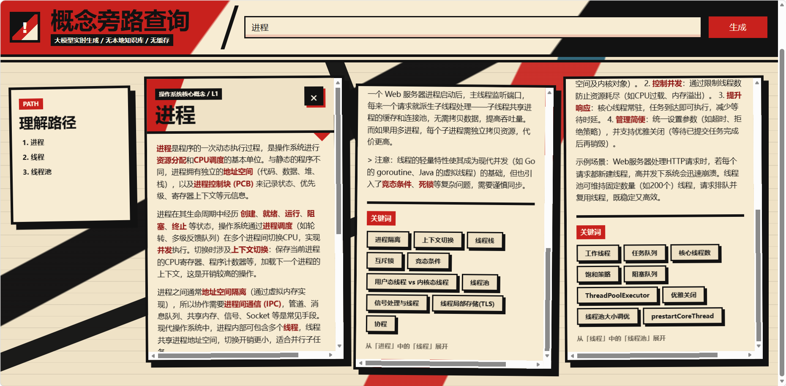

# 概念旁路查询

一个本地静态网页原型，用来解决大模型学习时的“概念旁路打断”问题。

当你向大模型询问一个概念时，回答里经常会引出新的术语。传统聊天里，如果继续追问新术语，原来的主线容易被打断。本项目把回答组织成横向卡片：主概念保留在原位，正文里的任意词和模型推荐关键词都可以继续生成下一张卡片，从而形成一条可回溯的理解路径。



## 特性

- 直接打开 `index.html` 使用，不需要部署。
- 默认使用 DeepSeek Chat Completions API。
- 不使用本地知识库。
- 不缓存结果，每次查询都实时请求模型。
- 模型自由生成正文，不强制三段结构。
- 正文中的词会自动分词并变成可继续展开的入口。
- 模型额外返回的 `keywords` 会作为推荐旁路入口展示。
- 子概念请求会带上父概念上下文，尽量避免脱离主线。
- UI 使用先锋主义/构成主义风格：红黑米白、高对比、硬边框、斜切构图。

## 使用方式

1. 用浏览器打开 `index.html`。
2. 填写 DeepSeek API Key。
3. 输入一个主概念，例如 `进程`、`mmap`、`页表`。
4. 点击“生成”。
5. 点击正文里的任意词，或点击卡片底部的推荐关键词，继续展开旁路概念。

默认配置：

```txt
API: https://api.deepseek.com/chat/completions
Model: deepseek-v4-flash
```

## 模型返回协议

前端会要求模型返回 JSON：

```json
{
  "title": "概念名",
  "type": "标签",
  "answer": "自由格式正文，可以包含简单 Markdown",
  "keywords": [
    {
      "text": "关键词",
      "query": "带上下文的后续查询意图",
      "reason": "为什么值得继续展开"
    }
  ]
}
```

其中：

- `answer` 是卡片正文，模型可以自由组织内容。
- `keywords` 是模型推荐的旁路入口。
- 正文里的词不需要模型逐个返回，前端会使用浏览器分词自动包成可点击入口。
- `query` 会帮助模型在父概念语境下解释关键词。

## 文件结构

```txt
.
├── index.html
├── styles.css
├── app.js
├── README.md
└── LICENSE
```

## 注意事项

- API Key 只存在当前页面内存中，本项目不会主动保存。
- 由于是浏览器直接请求 DeepSeek API，如果接口或网络环境限制 CORS，页面可能请求失败。
- 当前版本没有本地代理、没有后端、没有缓存、没有本地知识库。
- 中文分词优先使用浏览器内置的 `Intl.Segmenter`；不支持时会退回到简单分词。
- 如果要长期使用，后续可以增加本地代理、请求缓存、导出理解路径等功能。

## License

This project is licensed under the MIT License. See [LICENSE](LICENSE) for details.
